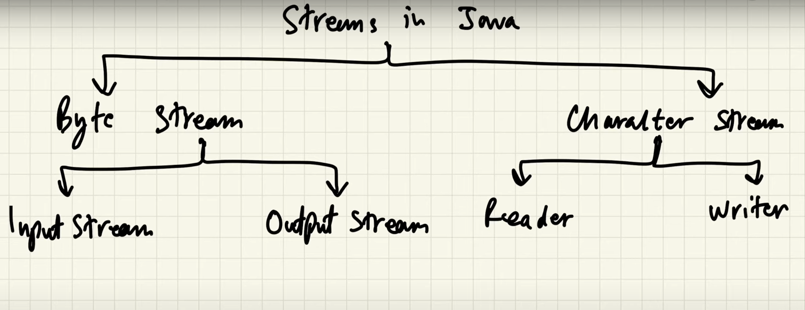

# File handling in java
## Streams in java
-> In java, In Java, the concept Stream is used in order to perform I/O operations on a file. So at first, let us get acquainted with a concept known as Stream in Java

Types of streams
1. Input stream
    -> Input stream is the super class of all the input streams. It is used to read data from the input devices like keyword, network etc. It is a abstract class  so it is not directly useful by itself but the classes which implement or extent this class are useful for reading data.
   
   Types of input streams

    * AudioInputStream
    * ByteArrayInputStream
    * FileInputStream
    * FilterInputStream
    * StringBufferInputStream
    * ObjectInputStream
   
   > Common Methods in InputStream 
   
4. Output stream
    -> This class is used to write the data to various devices like monitor, file etc.
   * ByteArrayOutputStream
   * FileOutputStream
   * StringBufferOutputStream
   * ObjectOutputStream
   * DataOutputStream
   * PrintStream
   
    >Common methods in output stream.
    
   
## File operations
* Create a File
 
* Read from a File
* Write to a File
* Delete a File

## On the basis of types of data (byte and character)

## InputStreamReader
> It is a bridge between byte data and character data.Its reads the InputStream i.e byte data converts them into the character data. It is a child class of Reader
> 